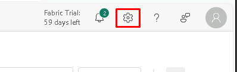
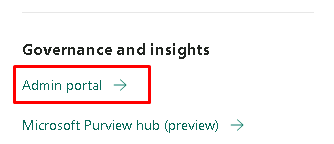
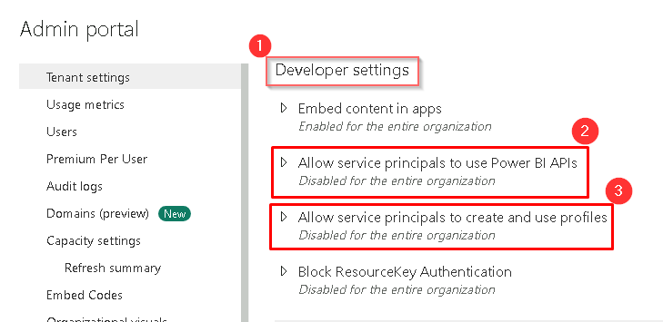
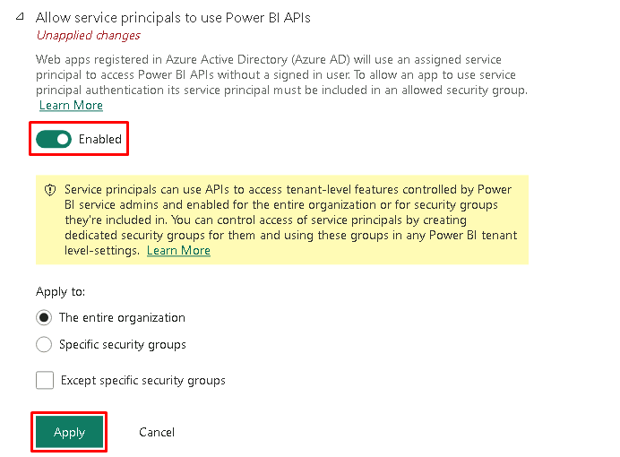
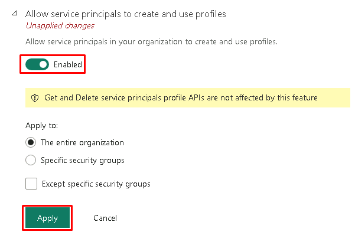
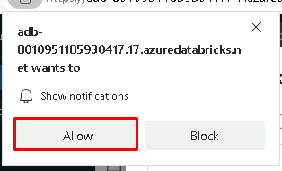
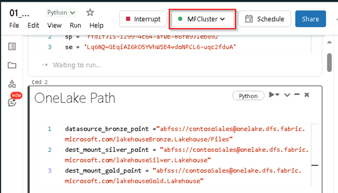
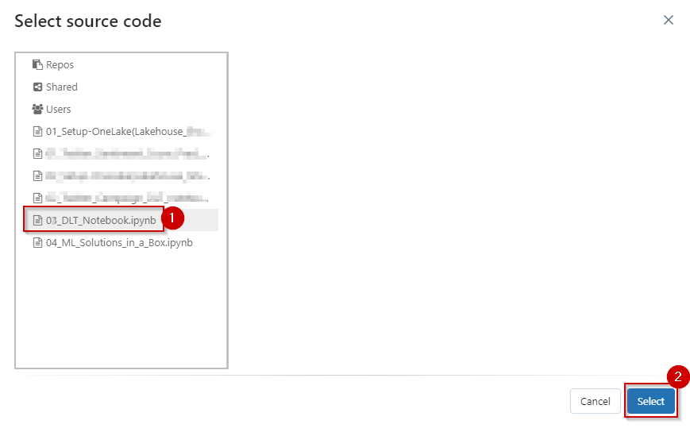
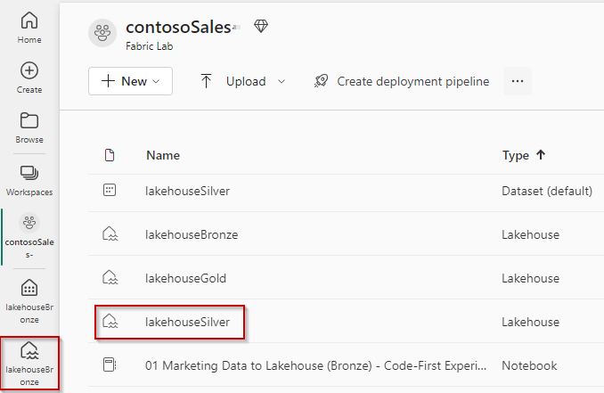
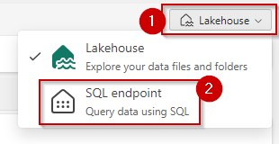

## Exercise 2: Explore an analytics pipeline using open Delta format and Azure Databricks Delta Live Tables. Stitch data (landed earlier) to create a combined data product to build a simple Lakehouse and integrate with OneLake

### Task 2.1: Set up an Azure Databricks environment

**Integrate OneLake with Databricks:**

**Use OneLake with existing data lakes using Shortcuts:**

*Shortcuts function as a symbolic link to data, allowing a live connection to the target data from another location. Shortcuts can be created and then linked to any data within OneLake, or to external data lakes such as Azure Data Lake Storage Gen2 (ADLS Gen2) or Amazon S3. Contoso had gold layer Twitter data in their ADLS Gen2 which they connected with a shortcut to OneLake.*

**Use and land data directly in OneLake:**

*Since OneLake uses the same APIs as ADLS Gen2 and supports the same Delta Parquet format for data storage, Azure Databricks notebooks can be seamlessly updated to use the OneLake endpoints for the data. This keeps the paths consistent across experiences whether the data consumer is querying data through a warehouse in Microsoft Fabric or a notebook in Azure Databricks.*

**In this exercise**,you will use second option Use and land data directly in OneLake.

Contoso already had some of their compute workload on **Azure Databricks**. You don’t need to migrate any of that workload to work with Fabric. You can simply use the OneLake endpoint to mount the storage and work with the same data directly from the Lakehouse for their analytical and ML operations.

### Currently there are two ways to authenticate OneLake.

1. Click on the **Setting Icon** above in the right corner of the page.

   `Note: If you are not seeing settings icon, click on the three dots next to Fabric Trail: 59 days left and in the drop down click on Settings Icon.` 

	

3. After clicking on the Setting Icon, scroll down the right panel that appeared and click on the **Admin Portal** under Governance and Insights.

	

4. In the **Admin Portal** scroll down to the **Developer Settings** and enable the access for Service Principal by clicking on drop down.

	

5. Click on the **toggle button** to enable and **Apply** button allow service principals to use PowerBI APIs. 

	

6. Click on the **toggle button** to enable and **Apply** button allow service principals to create and use profiles.

	


7. From the left navigation pane, click on **Workspaces** and select the **contosoSales** workspace.

	

8. Click on the **three dots** and select **Manage access**.

	

`Note: Manage access might be available in the pane also. If so, there is no need to click on the three dots.`

8. In the right pane, click on **+ Add people or groups**.

	


9. Copy paste the below value and Click on the **dropdown button**, select **Admin** and click on **Add**.

```BASH
 <inject key="ServicePrincipal" enableCopy="true"/>**
```


10. Close the window.

	

11. Navigate to the **Azure Portal**, search for **fabric-dpoc** in the search tab and select the resource group name starting with **fabric-dpoc**.

    

12. In the resource group, search for **databricks** and click on the databricks resource.

	

12. In the databricks resource, click on the **Launch Workspace** button.

	

`Note: click on Skip onboarding or Close any popups that appear.`

13. In the left navigation pane, select **Workspace**, click on **Workspace** in the Workspace navigation menu and then click on the **01_Setup-OneLake_Integration_with_Databrick** notebook.

	

`Note: Skip or Close any popups you see.`

14. In the cell named **OneLake Path** or **cmd 2**, replace **"#WORKSPACE_NAME#"** from Hash to Hash, with the earlier created Fabric workspace and verify the lakehouse names. Make sure that the name matches with the lakehouses you created in Exercise 1.

```BASH
contosoSales
```


15. Click on the **Run all** button. A new window will pop up.

	

16. Click on the allow notification if a pop up appears.

	


17. Click on the **Start, attach and run** button to start executing the notebook.

	

18. After you click on **Start, attach and run** check for the cluster to get attach to the notebook.
   
	

`Note: Wait for 5 to 6 minutes before moving on to next step to get the successfull execution of notebook`

21. Once the setup notebook runs successfully, mounting to the storage account is complete.


### Task 2.2: Create a Delta Live Table pipeline

In this task, you can create a Delta Live Table pipeline.

*Delta Live Tables (DLT) allow you to build and manage reliable data pipelines that deliver high-quality data in Lakehouse. DLT helps data engineering teams simplify ETL development and management with declarative pipeline development, automatic data testing, and deep visibility for monitoring and recovery.*

1. Select the **Workflows** icon in the left navigation pane.

	

2. Select the **Delta Live Tables** tab and click on the **Create pipeline** button.

	

3.	In the **Create pipeline window**, enter **Delta Live Table Pipeline** in the Pipeline name box.

```BASH
Delta Live Table Pipeline
```


4. Scroll down to the **Source Code**. Under the Source Code in the paths, select the notebook icon.

   `Note: If you are not able to see screen completely please zoom out the main browser.`


5.	In the **Select source code** window, select the **02_DLT_Notebook.ipynb** notebook and click on **Select**.



6. Click on the **Create** button.

	

*Once you select **Create**, the Delta Live Table pipeline with all the notebook libraries added to the pipeline will be created.*

`Note: If you are not able to see screen completely please zoom out the main browser.`

7. Click **Start**.

	

*Databricks will start executing the pipeline which will take approximately 5 minutes.*

8. This is the view you would see once the pipeline is executed. Observe the data lineage of bronze, silver and gold tables.

	


### Task 2.3: Explore SQL Analytics with Lakehouse SQL-endpoint

*Every Lakehouse comes with a default SQL endpoint which can be used for querying purposes using SQL syntax.*

*We can go from Lakehouse to SQL endpoint in the same window by selecting SQL endpoint from the Lakehouse dropdown menu in the top right corner of the window.*

1. In the left navigation bar, Click on the **Workspaces** click on **contosoSales**.

	

2. Scroll down to **lakehouseSilver** and click on it to open it and work on **SQL Analytics endpoint**

	

`Note: You can also select lakehouseSilver from the contosoSales workspace.`

2. Hard refresh the page using **Ctrl + Shift + R**. 

*A hard refresh helps load the delta tables in the lakehouse.*

3. Click the **Lakehouse dropdown button** in the top right corner of the screen and select **SQL endpoint** or **SQL Analytics endpoint**.

	

`Note: Wait for the SQL endpoint to load.`

4. Here is a list of all the tables in open-standard delta format. We can run queries on these tables to get the insights we need for the next step.

	

#### SQL Query

5. Click on the **New SQL Query** button.

	

*We can write a query to get the insights from sales data that we ingested using the shortcut names 'sales-transaction-litware'.*

*We can also run queries with complex joins on the same table to get LitWare Inc.’s top 10 bestselling products and see how fast we can get the results. When running the queries, we get the result within seconds, and once it is in cold cache, it will take even less time to get the results. These queries showcase the data engineering experience in Microsoft Fabric.*

#### Visual Query

6. Click on **New visual query**.

	

*We can drag and drop tables from the Lakehouse to the canvas and establish a relationship between them before executing the query.*
