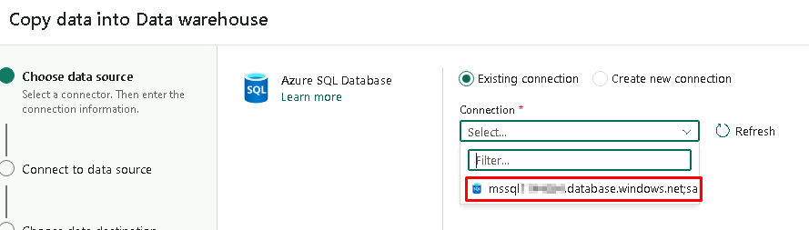
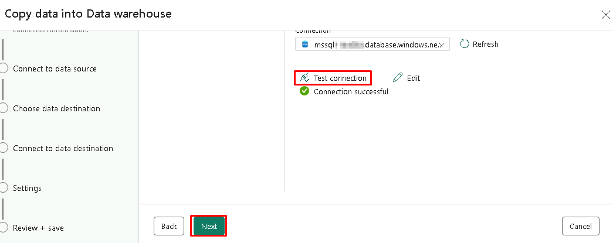

## Exercise 3: Data Science experience, explore Machine Learning and Business Intelligence scenarios.

So, we saw how Contoso was able to combine their historical gold layer data from ADLS Gen2 with all the data in OneLake via shortcuts. We also saw how all that data could be easily accessed in Azure Databricks (thanks to it being in the standard delta parquet format) and the ability to mount Onelake as an endpoint in Azure Databricks. We saw delta live tables being created for further curation of data in Azure Databricks. Now, we go a step beyond to see the power of ML models in ADB being leveraged on that data so Contoso can gain meaningful insights and see customer churn predictions. As Data Scientist let's see how we can explore the Data Science Experience in Azure Databricks and Microsoft Fabric!

### Task 3.1: Build ML models, experiments, and Log ML model in the built-in model registry using MLflow and batch scoring.

#### Databricks

The architecture diagram shown here illustrates the end-to-end MLOps pipeline using the Azure Databricks managed MLflow. 

After multiple iterations with various hyperparameters, the best performing model is registered in the Databricks MLflow model registry. Then it is set up as the model serving in the Azure Databricks Workspace for low-latency requests.
	
   

1. Navigate back to the **Databricks workspace** we started for the previous exercise.

2. In the left navigation pane, select **Workspace** and click **Workspace** again. Click on the **03_ML_Solutions_in_a_Box.ipynb** notebook.

	

Now that we've ingested and processed our customer data, we want to understand what makes one customer more likely to churn than another, so we want to see if we can produce a machine learning model that can accurately predict if a particular customer will churn.

Ultimately, we would like to understand our customers' sentiment so we can create targeted campaigns to improve our sales.

3. Navigate to **cmd 10**.

With the data prepared, we can begin exploring the patterns it contains. 

Let's start by examining the customer churn outcome based on factors like the tenure in months and the total amount spent by them. As a result, we can see a high churn rate is seen if the customer tenure is low, and they have a lower spend amount.

   

4. Navigate to **cmd 20**.

5. Navigate to **cmd 21**. 

By registering this model in Model Registry, we can easily reference the model from anywhere within Databricks. 

   

6. Review the **cmd 29** cell.

Let’s look at the comparison of multiple runs in the UI.

You can visualize the different runs using a parallel coordinates plot, which shows the impact of different parameter values on a metric.

The best ML model for Customer Churn is selected and registered with Databricks model registry.

   

7. Navigate to **cmd 38**.

For low-latency use cases, you can use MLflow to deploy the model for online serving. The serving system loads the Production model version from the Model Registry. 

   

8. Navigate to **cmd 40**.

It is then used to predict the probability of Customer Churn using the deployed model and this model endpoint is ready for production.

   

9. Navigate to **cmd 41**. 

Once we have the predicted data, it is stored back in delta tables in the gold layer back in OneLake.

   	


## Exercise 4: Data Warehouse experience, explore SQL Analytics with Data Warehouse.

Now let's see how Contoso was able to easily create Data Warehouses for its various departments. We'll start with the illustration of the Sales department. A Data Anlayst can easily create virtual warehouses and run cross database queries.How cool is that?!

### Task 4.1: Create a Data Warehouse

1. In the bottom-left corner of the Power BI tab, click on **Power BI**.

`Note: You may see Data Science instead.` 

2. Select **Data Warehouse**.

	

3. Click on **Warehouse (Preview)**.

	

4. In the 'New Warehouse' pop-up, paste the name **salesDW**.

```BASH
salesDW
```

5. Click **Create**.

	

### Task 4.2: Load data in the warehouse

1. Click **Get data**.

2. Select **New data pipeline**.

	

`Note: It will take some time for the page to load.`

3. In the pop-up, paste the name **02 Sales data from Azure SQL DB to Data Warehouse - Low Code Experience**.

```BASH
02 Sales data from Azure SQL DB to Data Warehouse - Low Code Experience
```

4. Click **Create**.

	

5. **Wait** for a new pop-up.

6. Scroll down in the pop-up.

7. Select **Azure SQL Database**.

8. Click **Next** button.

	

9. Since you have already created a connection earlier, select from the drop down below as seen in the picture.

	

10. Click on **test connection** and **Next**.

	


11. In **Connect to data source**, select **Existing tables**, select **Select all** and then click on the **Next** button.

	

12. In **Choose data destination** select the **Data Warehouse** and click the **Next** button.

	

13. In **Connect to data destination**, select **Load to new table** and click on the **Source** checkbox. Then click the **Next** button.

	

14. In the **Settings** section, keep it **default** and click the **Next** button.

	

15. In the **Review + save** section, scroll down to the end and then click the **Save + Run** button.

		

`Note: When you click on Save + Run the pipeline is automatically triggered.`

16. If the below screen is prompted click on the **OK** button.

		

17. **Check** the notification or pipeline output screen for the progress of copy database.

	

18. In the progress section of the pipeline, check the **status** of the running pipeline in the output section below.

	

`Note: Wait for the resultant data to load.`

19. **Wait** for the status of the pipeline to display **Succeeded** and go back to the **Data Warehouse** from the workspace.

	


**OPTIONAL TASK 4.3**

### Task 4.3: Create virtual Data Warehouses

Introducing virtual warehouses, where we not only analyze data from the department, but also query any data from another warehouse or a lakehouse SQL end point - across the organization from any department.

1. Click on the **+ Warehouse** button.

	

2. In the pop-up window, select the **lakehouseSilver SQL Endpoint checkbox** and click on the **Confirm** button.

	

`Note: It will take a few seconds for the new warehouse to appear.`
`
