# Modern Analytics with Microsoft Fabric and Azure Databricks DREAM Lab

**The estimated time to complete this lab is 45-60 minutes.**

## Table of contents

### Exercise 1: Data Engineering experience, Data ingestion from a spectrum of analytical data sources into OneLake

- Task 1.1: Create a Microsoft Fabric enabled workspace

- Task 1.2: Create/Build a Lakehouse

- Task 1.3: Data ingestion
    -   Using Data Pipelines/Data Flow ‘No Code-Low Code experience’
	-   Using ‘New Shortcut’ option from external data sources
    -   Using Spark Notebook ‘Code-first experience’

### Exercise 2: Explore an analytics pipeline using open Delta format and Azure Databricks Delta Live Tables. Stitch data (landed earlier) to create a combined data product to build a simple Lakehouse and integrate with OneLake

- Task 2.1: Set up an Azure Databricks environment

- Task 2.2: Create a Delta Live Table pipeline

- Task 2.3: Explore SQL Analytics with Lakehouse SQL-endpoint

### Exercise 3: Data Science experience, explore Machine Learning and Business Intelligence scenarios

- Task 3.1: Build ML models, experiments, Log ML model in the built-in model registry using MLflow and batch scoring

### Exercise 4: Data Warehouse experience, explore SQL Analytics with Data Warehouse

- Task 4.1: Create a Data Warehouse

- Task 4.2: Load data in the warehouse

- Task 4.3: Create virtual Data Warehouses

### Exercise 5: Real-time Analytics experience, explore Streaming data using KQL DB for a near real-time analytics scenario

- Task 5.1: Create a KQL Database

- Task 5.2: Ingest real-time/historical data into KQL DB

- Task 5.3: Analyze/discover patterns, identify anomalies and outliers using Kusto Query Language

- Task 5.4: Create a Real-time Power BI report using KQL DB/KQL Query

### Exercise 6: Power BI reports with Direct Lake

- Task 6.1: Leverage Power BI to derive actionable insights from data in Lakehouse using Direct Lake mode

## Overview

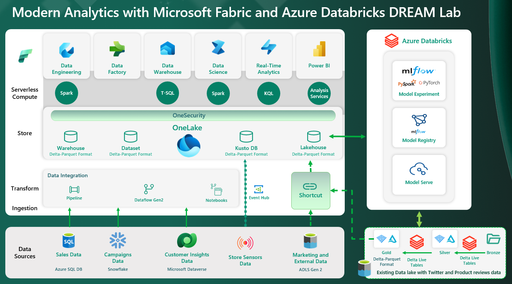

This demo/lab showcases Modern Analytics with Microsoft Fabric and Azure Databricks. The Analytics solution pattern is a cost-effective, performance-optimized, and cloud-native architecture which helps our customers unify their data estate to accelerate data value creation. The visual here depicts the Microsoft Analytics Solution pattern. The solution layers depicted here are as follows:

**1. Synapse Data Engineering:**

Combines the best of the data lake and warehouse, removing the friction of ingesting, transforming, and sharing organizational data, all in an open format. Users can choose from various ways of bringing data into the Lakehouse including dataflow & pipelines, and they can even use shortcuts to create virtual folders and tables without any data movement between the storage accounts. The goal is to simplify the process of working with organizational data. Rather than spending time on integrating various products, managing infrastructure, and stitching together a spectrum of data sources, Microsoft aims to empower data engineers to focus on their core responsibilities and tasks.

**2. Data Factory:**

Data Factory empowers users with a modern data integration experience to ingest, prepare and transform data with intelligent transformations, and leverage a rich set of activities. Data Factory primarily implements dataflows and pipelines.	Dataflows provide a low-code interface for ingesting data from hundreds of data sources, with 300+ data transformations. Data pipelines enable powerful workflow capabilities to build complex ETL and data factory workflows that can perform many different tasks at scale, refresh dataflow, move PB-size data, and define sophisticated control flow pipelines.	With its fast copy (data movement) capabilities in both dataflows and data pipelines, it enables users to move data between stores blazing fast.

**3. Synapse Data Science:**

Microsoft Fabric offers Data Science experiences, empowering users to complete a wide range of activities across the entire data science process. All the way from data exploration, preparation and cleansing to experimentation, modeling, model scoring and serving of predictive insights to BI reports. Synapse Data Science in Microsoft Fabric allows data science practitioners to work seamlessly on top of the same secured and governed data that has been prepared by data engineering teams. This eliminates the need to copy data. The open Delta Lake support allows data science users to version datasets to create reproducible machine learning code.

**4. Synapse Data Warehouse:**

Microsoft Fabric introduces a lake centric data warehouse built on an enterprise grade distributed processing engine that enables industry leading performance at scale while eliminating the need for configuration and management. The Warehouse is built for any skill level - from the citizen developer through to the professional developer, DBA or data engineer. The rich set of experiences built into Microsoft Fabric workspace enables customers to reduce their time to insights by having an easily consumable, always connected dataset that is integrated with Power BI in Direct Lake mode.

**5. Synapse Real-time Analytics:**

Real-time Analytics is fully integrated with the entire suite of Microsoft Fabric products, for both data loading, data transformation, and advanced visualization scenarios. Quick access to data insights is achieved through automatic data streaming, automatic indexing and data partitioning of any data source or format, and by using the on-demand query generation and visualizations. The main items available in Real-time Analytics include: Eventstream for capturing, transforming, and routing real-time events to various destinations with a no-code experience.	A KQL database for data storage and management. Data loaded into a KQL database can be accessed in OneLake and is exposed to other Microsoft Fabric experiences. A KQL queryset to run queries, view, and customize query results on data. The KQL queryset allows you to save queries for future use, export, and share queries with others. It includes the option to generate a Power BI report.

**6. Power BI:**

Power BI is standardizing open data formats by adopting Delta Lake and Parquet as its native storage format to avoid vendor lock-in and reduce data duplication and management. Direct Lake mode unlocks incredible performance directly against OneLake, with no data movement. Power BI datasets in Direct Lake mode enjoy query performance on par with import mode, with the real-time nature of DirectQuery. And the data never leaves the lake.

Contoso is a large enterprise with a presence in various industries such as retail, manufacturing, and finance. While this demo illustrates the transformation they implement in their retail business, it is equally applicable to the other industries as well.

On the retail side they have thousands of brick-and-mortar stores across the world. They also have an online store. April is the new CEO of Contoso. When April takes the helm of Contoso as its new CEO, she soon discovers some discouraging numbers for some of their most important company KPIs like revenue, churn rate, operating margin, and customer experience. She talks to her Chief Data Officer Rupesh, who is a data-driven decision maker. Our story is centered around Rupesh and the transformation he brings to Contoso. His CDO KPIs directly map to those company KPIs mentioned earlier. And he knows that departments in Contoso currently have their data in silos leading to huge integration challenges. 

In terms of integration challenges, Rupesh’s team is faced with yet another challenge. A while ago Contoso leadership had discovered that millennials were leaving them in large numbers because they didn’t have the brands and products that captivated their attention. With an eye on the future, they had decided to acquire LitWare Inc., an organization that carries the brands that millennials love. However, integrating LitWare Inc.’s Sales data with Contoso was a huge challenge, impacting on their projected revenue

Rupesh springs to action and rallies his team of data engineers, data scientists and data analysts to help overcome these integration challenges. Fortunately, they are exclusive participants of Microsoft Fabric (Preview) – a complete analytics platform for all the data users.

The demo illustrates how the Contoso team leveraged Microsoft Fabric with Azure Databricks to literally transform their KPIs. In this demo, you will see how they build an end-to-end analytics project focusing on role-centric data management experience to improve their KPIs and finally lead to a green dashboard for their CEO, April.

## Exercise 1: Data Engineering experience, Data ingestion from a spectrum of analytical data sources into OneLake

### Task 1.1: Create a Microsoft Fabric enabled workspace

1. **Open** the new tab in the browser and Copy the link https://app.powerbi.com/ and paste it to open the Power BI sign in page.

2. **Sign into** the Power BI.

	

	> **Note:** Use your Azure Active Directory credentials to login to Power BI.

3. In Power BI service **click** 'Workspaces'.

4. **Click** '+ New workspace' button.

	

5. **Enter** the name 'contosoSales' and **click** 'Apply'.

>**Note:** Do not use spaces in the workspace name.

>If the name 'contosoSales' is already taken, add a suffix to the end of the name (for example 'contosoSalesTest').

>The workspace name should not include any spaces.

   

6. In the workspace **click** the three dots(Ellipsis) and **select** 'Workspace settings'.

	

7. In the left pane, of the side bar **click** 'Premium', scroll down and **check** the 'Trial' radio box.

	

>**Note:** All workspaces used in this demo use 'Trial' License type. 

8. **Scroll down** and **click** on 'Apply'.

	


### Task 1.2: Create/Build a Lakehouse

1. In Power BI service **Click** '+ New' and then **select** 'Show all'.

    

2. In the new window **click** 'Lakehouse(Preview)'.

    

3. **Enter** the name as 'lakehouseBronze'.

4. **Click** 'Create' button.

    

5. **Click** 'Workspaces' and **select** 'contosoSales'.

	

>**Note:** For this lab we need three lakehouses altogether, for creating the rest two please follow the below given step.

6. **Repeat** steps 1 through 5 to create two more lakehouses with names 'lakehouseSilver' and 'lakehouseGold' respectively.


### Task 1.3: Data Ingestion
    
### Using Data Pipelines/Data Flow ‘No Code-Low Code experience’

1. While you are in the 'contosoSales' workspace **click** '+ New' button and **select** 'More options'.

	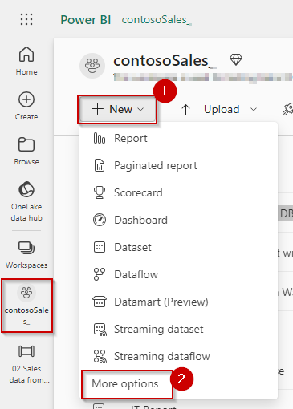

>**Note:** In place of 'More options' you might see 'Show all'.

2. Under Data Factory section, **select** 'Data pipeline (Preview).

	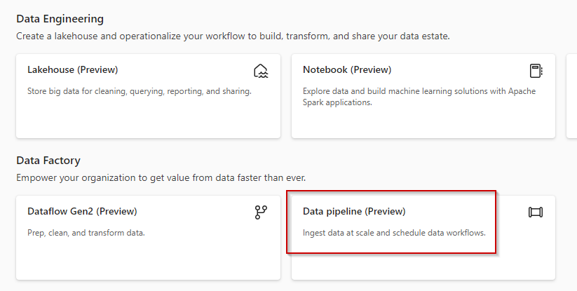

3. In the pop-up, **enter** the pipeline name 'Sales data from Azure SQL DB - Low Code Experience' and **click** on 'Create' button.

	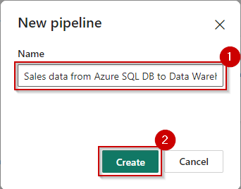

4. **Click** on 'Copy data'.

    

5. In the pop-up, **scroll down** through the resources, **click** on 'Azure SQL Database' and **click** on 'Next' button.

    

>**Note** You might not find Azure SQL Database at the same position as in screenshot, please look for the same.

6. **Select** the 'Create new connection' radio button.

    

>**Note:** To fill in the details for required fileds, we need to fetch the data from the SQL Database resource deployed in Azure Portal.

7. **Navigate** to the Azure Portal, **search** for 'fabric-dpoc' in the search tab and **select** the resource group name starting with 'fabric-dpoc'.

    

8. **Search** for 'sql server' in the resource group window and **click** on the sql server resource.

    

9. In the resource window **copy** the 'Server admin'.

10. **Save** it in a notepad for further use.

11. **Copy** the 'Server name'.

12. **Save** it in a notepad for further use.

13. **Click** 'SQL databases' under the Settings in the left pane.

	

14. **Copy** the name of database and **paste** it in a notepad for further use.

	

15. **Go back** to the Power BI tab.

16. In the 'Server' and 'Database' field **paste** the values copied in step number 11 and 14.

	

17. **Select** Authentication kind as 'Basic', **enter** Username as 'labsqladmin', Password as 'Smoothie@2023' and finally **click** on the 'Next' button.

   

>**Note:** Wait for the connection to get created.

18. **Select** 'Existing tables' radio button, **click** on the checkbox for the first table below the Select all option, and then **click** on 'Next' button.

	

19. **Scroll down** and **click** on 'Lakehouse' and then **click** on 'Next' button.

	

20. **Select** the 'Existing Lakehouse' radio button, **click** on the dropdown, **select** 'lakehouseBronze' and then **click** on the 'Next' button.

	

21. **Select** 'Load to new table' radio button, **click** on the checkbox beside Source and then **click** on 'Next'.

	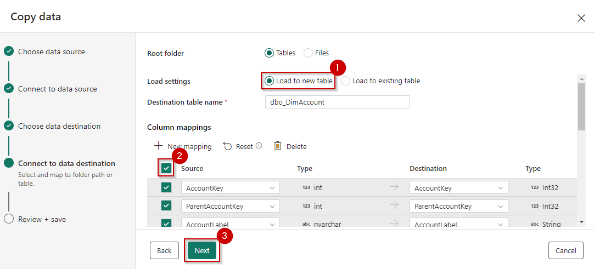

22. **Click** on 'Save + Run'.

	

23. **Click** on the Notification icon on right top and **verify** the Running status of the pipeline.

	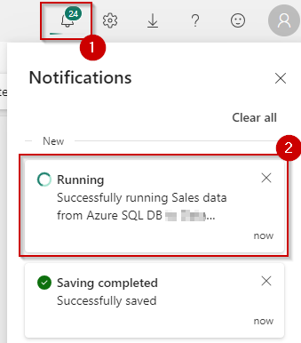

>**Note:** Please wait for the pipeline execution.

24. Once the status shows 'Run Succeeded', your data has been transfered from Azure SQL Database to Lakehouse.

	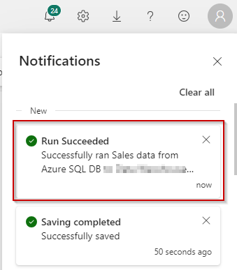

25. Similarly you can get data into the Lakehouses using pipelines from various other sources like Snowflake, Dataverse etc.

26. Due to time constraints we will be moving forward to the futher steps.


### Using ‘New Shortcut’ option from external data sources

1. In Power BI, **click** 'Workspaces' and **select** 'contosoSales'

    

2. In 'contosoSales' workspace, **click** on 'lakehouseBronze' lakehouse.

    

3. In the lakehouse window **click** on the 'collapse' icon in front of Files if it is expanded.

>**Note:** When the collapse icon is expanded, the three dots icon is not visible.

4. **Click** on the three dots in front of Files.

5. **Click** on 'New shortcut'.

	

6. In the pop-up window, under External sources **select** 'Azure Data Lake Storage Gen2'

	

>**Note:** Please wait for the screen to load after clicking.

7. In the screen below we need to enter connection details for the ADLS Gen2 shortcut, for which we need to fetch the details from the Storage Account resource.

	

8. **Navigate** to the Azure Portal, **search** for 'fabric-dpoc' in the search tab and **select** the resource group name starting with 'fabric-dpoc'.

    

9. **Search** for 'storage account', **click** the storage account resource.

	

10. In the resource window **goto** the left pane and **scroll down**.

11. In 'Security + networking' section, **click** 'Access keys'.

12. **Click** 'Show' button under key1.

	

13. **Click** 'Copy to clickboard' button.

14. **Save** it in a notepad for further use.

	

15. **Scroll down** in the left pane.

16. **Select** 'Endpoints' from 'Settings' section.

17. **Scroll down** and **copy** the 'Data Lake Storage' endpoint under 'Data Lake Storage' section.

18. **Save** it in a notepad for further use.

	

>**Note:** You may see different endpoints as well in the above screen. Make sure to select only the Data Lake Storage endpoint.

19. **Navigate back** to Power BI workspace i.e. the Power BI tab which we working earlier.

20. **Paste** the endpoint copied under the 'URL' field.

21. In the 'Authentiation kind' dropdown, **select** 'Account Key'.

22. **Paste** the account key copied in step number 13.

23. **Click** on 'Next'.

	

24. Under Shortcut Name **type** 'data'.

25. Under Sub Path **type** '/adlsfabricshortcut'.

26. **Click** on the **Create** button.

	

27. **Click** on the three dots in front of Files.

28. **Click** on 'New shortcut'.

	

29. In the pop-up window, under External sources **select** 'Azure Data Lake Storage Gen2'

	

>**Note:** Please wait for the screen to load after clicking.

30. **Paste** the endpoint copied under the 'URL' field.

>**Note:** The details entered earlier will be auto fetched, if not, follow the steps 31 and 32.

31. In the 'Authentiation kind' dropdown, **select** 'Account Key'.

32. **Paste** the account key copied in step number 13.

33. **Click** on 'Next'.

	

34. Under Shortcut Name **type** 'sales-transaction-litware'.

35. Under Sub Path **type** '/bronzeshortcutdata'.

36. **Click** on the **Create** button.

	


### Using Spark Notebook ‘Code-first experience’

1. While you are in the Power BI workspace, **click** 'Power BI' at bottom left corner and **select** 'Data Science'.

	

2. **Click** 'Import notebook'.

	
	
3. In the Import Status, **click** 'Upload' button.

	
	
4. **Browse** to the notebooks from your local system through the path "C:\LabFiles\IgniteDreamLab2023\artifacts\fabricnotebooks", **select** all the notebooks and **click** the 'Open' button.

	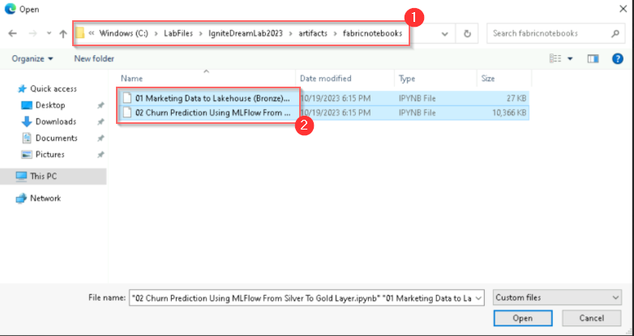

5. **Click** the 'notification' icon to check the status of upload. 

	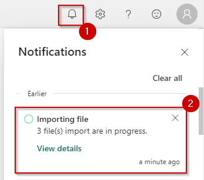

6. Once upload is done, it will show the notification as 'Imported succussfully'. **Click** on 'Go to Workspace'.

	

7. In the workspace **click** on the "01 Marketing Data to Lakehouse (Bronze) - Code-First Experience" notebook.

	

8. In the left pane, **click** on 'Missing Lakehouse' button and **select** 'Remove all Lakehouses'.

	

>**Note:** In case you do not see Missing lakehouse, you would see 'lakehouse{Name}', click on the same to get the 'Remove all Lakehouses' option.

9. **Click** on 'Continue' in the pop-up window.

	

10. In the left pane, **click** on the 'Add' button.

	

11. In the pop-up **select**, 'Existing Lakehouse' radio button and then **click** on 'Add' button.

	

12. **Click** on 'lakehouseBronze' checkbox and **click** on 'Add'.

	

13. This notebook is used to fetch the data to the Bronze Lakehouse.

	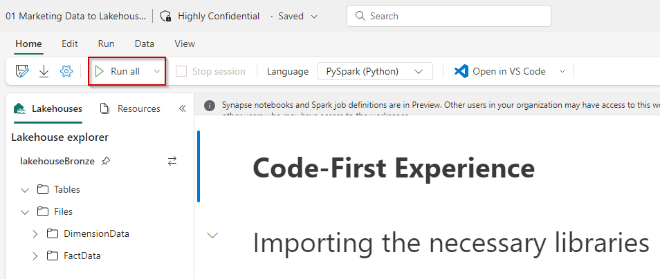

>**Note:** Due to time constraints, we will not run this notebook.

>**Note:** Goto the cell with name 'Shortcut Folder Path', replace '#WORKSPACE_NAME#' with the Fabric Workspace name you are working on and also verify the lakehouse name which should be the Bronze Lakehouse you created.

   

## Exercise 2: Explore an analytics pipeline using open Delta format and Azure Databricks Delta Live Tables. Stitch data (landed earlier) to create a combined data product to build a simple Lakehouse and integrate with OneLake

### Task 2.1: Set up an Azure Databricks environment

**Integrate OneLake with Databricks:**

**Use OneLake with existing data lakes using Shortcuts:**

*Shortcuts function as a symbolic link to data, allowing a live connection to the target data from another location. Shortcuts can be created and then linked to any data within OneLake, or to external data lakes such as Azure Data Lake Storage Gen2 (ADLS Gen2) or Amazon S3. Contoso had gold layer Twitter data in their ADLS Gen2 which they connected with a shortcut to OneLake.*

**Use and land data directly in OneLake:**

*Since OneLake uses the same APIs as ADLS Gen2 and supports the same Delta Parquet format for data storage, Azure Databricks notebooks can be seamlessly updated to use the OneLake endpoints for the data. This keeps the paths consistent across experiences whether the data consumer is querying data through a warehouse in Microsoft Fabric or a notebook in Azure Databricks.*

1. From the left navigation, **click** on Workspaces and **select** 'contosoSales' workspace.

	

2. **Click** on the three dots and **select** 'Manage access'.

	

>**Note:** 'Manage access' might be available in the pane also. If so, there is no need to click on the three dots.

3. In the right pane, **click** on '+ Add people or groups'.

	

4. **Type** 'fabric' in the search box and **click** on the fabric service principal with the same suffix as the resource group.

	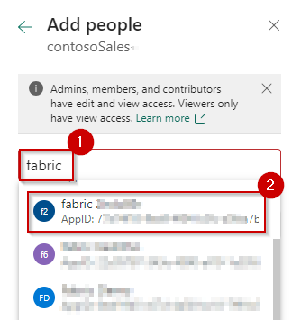

5. **Click** on the dropdown button, **select** 'Admin' and **click** on 'Add'.

	

6. **Close** the window.

	

7. **Navigate** to the Azure Portal, **search** for 'fabric-dpoc' in the search tab and **select** the resource group name starting with 'fabric-dpoc'.

    

8. In the resource group, **search** for 'databricks' and **click** on the databricks resource.

	

9. In the databricks resource, **click** on the 'Launch Workspace' button.

	

>**Note:** 'Skip/Close' any popups you see.

10. In the left navigation pane, **select** 'Workspace', **click** on 'Workspace' in the Workspace navigation menu and then **click** on '01_Setup-Onelake_Integration_with_Databrick' notebook.

	

>**Note:** 'Skip/Close' any popups you see.

11. In the cell named 'Onelake Path' or 'cmd 2' **replace** '#WORKSPACE_NAME#' with the current Fabric workspace name you are working and **verify** the lakehouse names. Make sure that the name **matches** with the lakehouses you created in Exercise 1.

	

12. **Click** on the 'Run all' button. A new window will pop-up.

	

13. **Click** on the 'Start, attach and run' button to start executing the notebook.

	

14. Once the setup notebook runs successfully, mounting to the storage account is complete.


### Task 2.2: Create a Delta Live Table pipeline

In this task, you can create a Delta Live Table pipeline.

*Delta Live Tables (DLT) allow you to build and manage reliable data pipelines that deliver high-quality data in Lakehouse. DLT helps data engineering teams simplify ETL development and management with declarative pipeline development, automatic data testing, and deep visibility for monitoring and recovery.*

1. **Select** the 'Workflows' icon, in the left navigation pane.

	

2. **Select** the 'Delta Live Tables' tab and **click** 'Create pipeline' button.

	

3.	In the Create pipeline window, **enter** 'Delta Live Table Pipeline' in the Pipeline name box.

	

4.	In the Source Code field, **select** the notebook icon.

	

5.	In the Select source code window, **select** the "02_DLT_Notebook.ipynb" notebook and **click** on Select.

	

6. **Click** on the 'Create'.

	

*Once you select **Create**, it will create the Delta Live Table pipeline with all the notebook libraries added to the pipeline.*

6. **Click** Start.

	

*Databricks will start executing the pipeline which will take approximately 1 minute.*

7. This is the view you would have seen. Observe the data lineage of bronze, silver and gold tables.

	


### Task 2.3: Explore SQL Analytics with Lakehouse SQL-endpoint

*Every Lakehouse comes with a default SQL endpoint which can be used for querying purposes using SQL syntax.*

*We from Lakehouse to SQL endpoint in the same window by selecting SQL endpoint from the Lakehouse dropdown menu in the top right corner of the window.*

1. In the left navigation bar, **click** on lakehouseSilver to **navigate** to SQL endpoint.

	

>**Note:** You can also select lakehouseSilver from the contosoSales workspace.

2. Hard refresh the page using 'Ctrl + Shift + R'. 

*Hard refresh helps load the delta tables in the lakehouse*

3. **Click** the Lakehouse dropdown button in the top right corner of the screen and **select** SQL endpoint.

	

>**Note:** Wait for the SQL endpoint to load.

4. Here is a list of all the tables in open-standard delta format. We can run queries on these tables to get the insights we need for the next step.

	

#### SQL Query

5. **Click** on 'New SQL Query' button.

	

*We can write a query to get the insights from sales data that we ingested using the shortcut names 'sales-transaction-litware'.*

*We can run queries with complex joins on the same table to get LitWare Inc.’s top 10 bestselling products and see how fast we can get the results. When running the queries, we get the result within seconds, and once it is in cold cache, it will take even less time to get the results. These showcase the data engineering experience in Microsoft Fabric.*

#### Visual Query

6. **Click** on 'New visual query'.

	

*We can drag and drop tables from the Lakehouse to the canvas and establish a relationship between them before executing the query.*

## Exercise 3: Data Science experience, explore Machine Learning and Business Intelligence scenarios.

### Task 3.1: Build ML models, experiments, Log ML model in the built-in model registry using MLflow and batch scoring.

#### Databricks

The architecture diagram shown here illustrates the end-to-end MLOps pipeline using the Azure Databricks managed MLflow. 

After multiple iterations with various hyperparameters, the best performing model is registered in the Databricks MLflow model registry. Then it is set up as the model serving in the Azure Databricks Workspace for low-latency requests.
	
   

1. **Navigate back** to the Databricks workspace we started for the previous exercise.

2. In the left navigation pane, **select** 'Workspace' and **click** 'Workspace' again **click** on '03_ML_Solutions_in_a_Box.ipynb' notebook.

	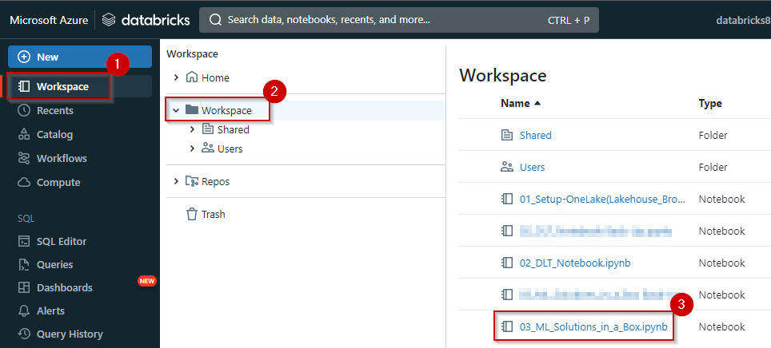

Now that we've ingested and processed our customer data, we want to understand what makes one customer more likely to churn than another, so we want to see if we can produce a machine learning model that can accurately predict if a particular customer will churn.

Ultimately, we would like to understand our customers' sentiment so we can create targeted campaigns to improve our sales.

3. **Navigate** to cmd 10.

With the data prepared, we can begin exploring the patterns it contains. 

Let's start by examining the customer churn outcome based on factors like the tenure in months and the total amount spent by them. As a result, we can see a high churn rate is seen if the customer tenure is low, and they have a lower spend amount.

   

4. **Navigate** to cmd 20.

5. **Navigate** to cmd 21. 

By registering this model in Model Registry, we can easily reference the model from anywhere within Databricks. 

   

6. **Review** the cmd 29 cell.

Let’s look at the comparison of multiple runs in the UI.

You can visualize the different runs using a parallel coordinates plot, which shows the impact of different parameter values on a metric.

The best ML model for Customer Churn is selected and registered with Databricks model registry.

   

7. **Navigate** to cmd 38.

For low-latency use cases, you can use MLflow to deploy the model for online serving. The serving system loads the Production model version from the Model Registry. 

   

8. **Navigate** to cmd 40.

It is then used to predict the probability of Customer Churn using the deployed model and this model endpoint is ready for production.

   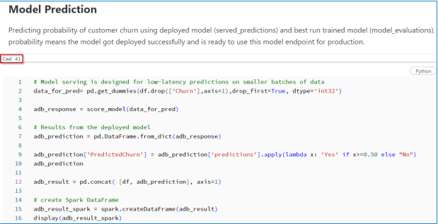

9. **Navigate** to cmd 41. 

Once we have the predicted data it is stored back in delta tables in the gold layer back in OneLake.

   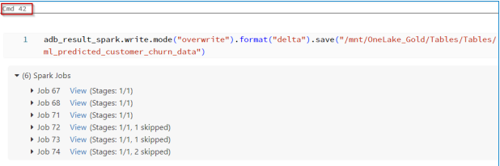	

#### Microsoft Fabric

Microsoft Fabric offers Data Science experiences to empower users to complete end-to-end data science workflows for the purpose of data enrichment and business insights. You can complete a wide range of activities across the entire data science process, all the way from data exploration, preparation and cleansing to experimentation, modeling, model scoring and serving predictive insights to BI reports.

1. **Navigate back** to the Power BI workspace.	
	
When building data science workflows, we can leverage data science services alongside Microsoft Fabric to handle different stages of the workflow, such as data ingestion, data processing, model training, and deployment. 
In this lab we have stored data science models as microservices within Microsoft Fabric, taking advantage of its scalability and reliability features.

   	

1. In Power BI service click on 'Workspaces' and **click** on 'contosoSales'. 

	

2. **Filter** 'Notebook' and **click** on the '02 Churn Prediction Using MLFlow From Silver To Gold Layer' notebook.

	

3. In the left pane, **click** on the 'Missing Lakehouse' button and **select** 'Remove all Lakehouses'.

	

>**Note:** If you do not see Missing lakehouse, you'll see 'lakehouse{Name}', click on that name to get the 'Remove all Lakehouses' option.

8. **Click** on 'Continue' in the pop-up window.

	

14. In the left pane, **click** on the 'Add' button.

	

15. In the pop-up **select** the 'Existing Lakehouse' radio button and then **click** on the 'Add' button.

	

16. **Click** on the 'lakehouseSilver' checkbox and **click** on 'Add'.

	

This notebook describes steps and scripts/code to create, evaluate and deploy a customer churn prediction model.

>**Note:** Due to time constraints, we will not run this notebook.

*Load Data using Drag & Drop.*

Microsoft Fabric allows an easy drag and drop feature to load the data from the delta tables.
We can simply drag the tables from lakehouseSilver and drop it to the notebook cell.

*Chart view to explore data.*

Microsoft Fabric provides an interactive visualization interface for exploring and analyzing data. 

It offers a variety of chart types and customization options to create insightful visualizations that help with understanding patterns, trends, and relationships within the data.

*Data Wrangler to preprocess data in lakehouses.*

Data Wrangler is a code tool that prepares data and generates Python code. This experience makes it easy to accelerate data cleansing and build repeatability and automation through generated code.


## Exercise 4: Data Warehouse experience, explore SQL Analytics with Data Warehouse.

### Task 4.1: Create a Data Warehouse

1. In the bottom-left corner of the Power BI tab **click** on 'Power BI'.

2. **Select** 'Data Warehouse'.

	

3. **Click** 'Data Warehouse'.

	

4. In the 'New Warehouse' pop-up, **type** the name 'salesDW'.

5. **Click** 'Create'.

	

### Task 4.2: Load data in the warehouse

1. **Click** 'Get data'.

2. **Select** 'New data pipeline'.

	

>**Note:** It will take some time for the page to load, please wait for the

3. In the pop-up, **type** the name '02 Sales data from Azure SQL DB to Data Warehouse - Low Code Experience'.

4. **Click** Create.

5. **Wait** for a new pop-up.

	

6. **Scroll down** in the pop-up.

7. **Select** 'Azure SQL Database'.

8. **Click** 'Next' button.

	

9. **Navigate** to the Azure Portal, **search** for 'fabric-dpoc' in the search tab and **select** the resource group name starting with 'fabric-dpoc'.

    

10. **Search** for 'sql server' in the resource group window and **click** on the sql server resource.

    

11. In the resource window **copy** the 'Server admin'.

12. **Save** it in a notepad for further use.

13. **Copy** the 'Server name'.

14. **Save** it in a notepad for further use.

15. **Click** 'SQL databases' under the Settings in the left pane.

	

16. **Copy** the name of the database and **paste** it in a notepad for further use.

	

17. **Go back** to the Power BI tab.

18. **Select** 'Create new connection' radio button, in the 'Server' field and **paste** the value copied in step number 13 and 16 in the 'Database' field.

	

19. **Select** 'Basic' for Authentication kind, **enter**  'labsqladmin' as the Username, 'Smoothie@2023' as the Password and then **click** on the 'Next' button.


20. Next, in 'Connect to data source', **select** 'Existing tables', then **select** 'Select all' and then **click** on the 'Next' button.

	

21. In 'Choose data destination' **select** the Data Warehouse and **click** 'Next' button.

	

22. In 'Choose data destination' **select** 'Load to new table' and **click** on the 'Source' checkbox. Then **click** the 'Next' button.

	

23. In the 'Settings' section, keep it default and **click** the 'Next' button.

	

24. In the 'Review + save' section, **scrolldown** to the end and then **click** 'Save + Run' button.

		

>**Note:** When you click on 'Save + Run' the pipeline is automatically triggered.

25. **Check** the notification or pipeline output screen for the progress of copy database.

	

26. In the progress section of the pipeline **check** the status of the running pipeline.

	

>**Note:** Please wait for the resultant data to load.

27. **Wait** for the status of the pipeline to display 'Succeeded' and **go back** to the Data Warehouse from the workspace.

	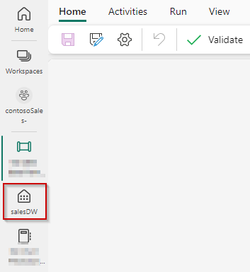


### Task 4.3: Create virtual Data Warehouses

Introducing virtual warehouses, where we not only analyze data from the department, but also query any data from another warehouse or a lakehouse SQL end point - across the organization from any department.

1. **Click** on the '+ Warehouse' button.

	

2. In the pop-up window, **select** the lakehouseSilver SQL Endpoint checkbox and **click** on the 'Confirm' button.

	

>**Note:** It will take a few seconds for the new warehouse to appear.


## Exercise 5: Real-time Analytics experience, explore Streaming data using KQL DB for a near real-time analytics scenario.

### Task 5.1: Create a KQL Database

1. In Power BI service click on 'Workspaces' and **click** on 'contosoSales'. 

	

2. **Click** on '+ New' and then **click** on 'Show all'.

	

>**Note:** You might also see 'More options' in place of 'Show all'

3. In the new window, **scroll down** to the 'Real-time Analytics' section and **click** on 'KQL Database (Preview)'.

	

4. **Enter** the name 'Contoso-KQL-DB', **click** on the 'Create' button and **wait** for the database to be created.

	

### Task 5.2: Ingest real-time/historical data into KQL DB

1. Once the database is created, **click** on 'Get data' and then **click** on 'Event Hubs'.

    

2. In the Destination tab, **select** the 'New table' radio button, type the name 'thermostat' and then **click** on the 'Next: Source' button.

    

3. In the Source tab, **select** the 'Event Hub' source type and **select** the 'Create new connection' radio button.

	

>**Note:** For the rest of the fields we need to move to the Azure Portal and fetch required values.

4. **Navigate** to the Azure Portal, **search** for 'fabric-dpoc' in the search tab and **select** the resource group name starting with 'fabric-dpoc'.

    

5. **Search** for 'Event Hubs Namespace' in the resource group window and **click** on the Event Hubs Namespace resource.

    

6. **Copy** the name of Event Hub namespace and **paste** it in a notepad for further use.

	

7. **Scroll down** in the left navigation pane and **click** on 'Event Hubs' under Entities section. 

	

8. **Click** on the 'thermostat' event hub.

	

9. **Click** on 'Shared access policies' in the left pane under 'Settings', then **click** on 'thermostat' and finally **copy** the primary key and **paste** it in a notepad for further use. 

   

10. **Go back** to the Power BI tab.

11. Make sure you are in the 'Create new connection' section, **scroll down** and **paste** the value for 'Event Hub namespace' from step 6 and enter 'Event Hub' value as 'thermostat'.

   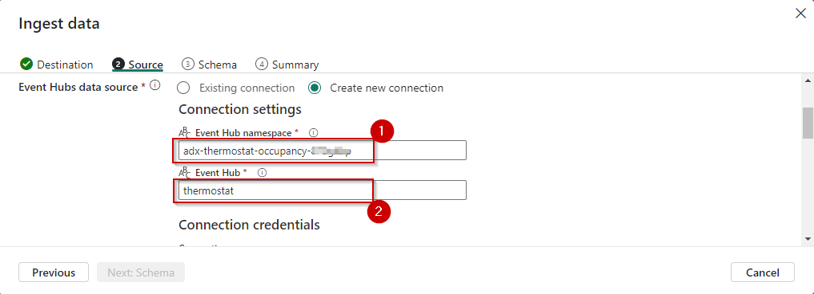

12. **Scroll down** and **select** 'Authentication kind' as 'Shared Access Key', **enter** 'Shared Access Key Name as 'thermostat' and then **paste** the value copied in step 9 in the 'Shared Access Key' and **click** on the 'Save' button.

   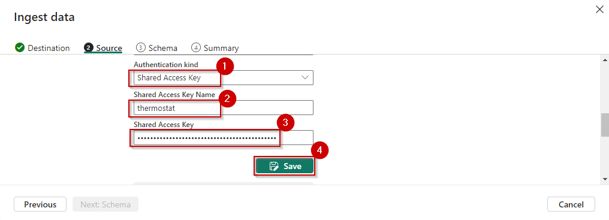

13. After you click on the Save button, **wait** for 'Consumer group' to 'auto load' and 'Next: Schema' button to be 'active'.

	

14. **Click** on the 'Next: Schema' button.

	

>**Note:** In the schema tab, data loading will take some time.

15. In Schema tab, **click** on the dropdown under 'Data format', **select** 'JSON' and **click** on the 'Next: Summary' button.

    

16. **Wait** for the ingestion to complete, you will notice green checks which denotes the completion, finally **click** on 'Close' button.

    

17. Hard refresh the page using **'Ctrl + Shift + R'** to see the
details for the ingested data.

   
	
Real-time data from the event hub has been ingested successfully into the KQL Database.

### Task 5.3: Analyze/discover patterns, identify anomalies and outliers using Kusto Query Language

Kusto Query Language is a powerful tool. In this scenario used to explore Contoso’s data, discover patterns, identify anomalies and outliers, create statistical modeling, and more.

We use KQL to query the thermostat data that’s streaming in near real-time from the devices installed in Contoso’s stores.

1. **Click** on the Workspace and **select** 'contosoSales'.

	

2. **Click** on '+ New' and **select** 'KQL Queryset(Preview)'.

	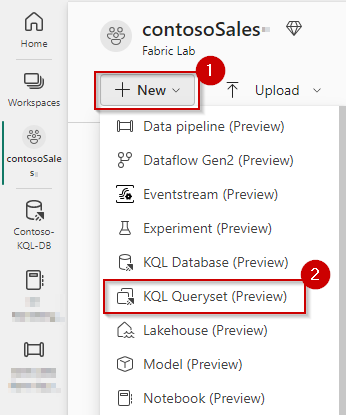

3. **Enter** 'Query Thermostat Data in Near Real-time using KQL Script' as the name and **click** on the 'Create' button.

	

4. **Wait** for the query set creation and a new screen will show up, in this screen **click** on 'Contoso-KQL-DB' **verify** the workspace name and then **click** on 'Select' button.

	

5. **Select all** and **delete** the pre-written query.

	

6. **Paste** the query given below in the query section.

```
//What is the average temperature every 1 min?
thermostat
| where EnqueuedTimeUTC >= ago(30d)
| where DeviceId == 'TH005'
| summarize avg(Temp) by bin(EnqueuedTimeUTC,1m)
| render timechart 

thermostat
| where EnqueuedTimeUTC < ago(1h)
| where DeviceId == 'TH020'
| summarize avg(Temp) by bin(EnqueuedTimeUTC,1m)
| render timechart 

.create-or-alter function myFunction(binsize:timespan)
{
thermostat
| where EnqueuedTimeUTC > ago(10d)
| where DeviceId == 'TH005'
| summarize avg(Temp) by bin(EnqueuedTimeUTC,binsize)
| render timechart 
}

myFunction(50m)

//What will be the temperature for next 15 Minutes?
thermostat
| where EnqueuedTimeUTC > ago(40d)
| make-series AvgTemp=avg(Temp) default=real(null) on EnqueuedTimeUTC from ago(400d) to now()+15m step 1m  
| extend NoGapsTemp=series_fill_linear(AvgTemp)
| project EnqueuedTimeUTC, NoGapsTemp
| extend forecast = series_decompose_forecast(NoGapsTemp, 15)
| render timechart with(title='Forecasting the next 15min by Time Series Decmposition')

//Are there any anomalies for this device?
thermostat 
| where EnqueuedTimeUTC > ago(12h)
| where DeviceId == 'TH005'
| make-series AvgTemp=avg(Temp) default=real(null) on EnqueuedTimeUTC from ago(20d) to now() step 1m 
| extend NoGapsTemp=series_fill_linear(AvgTemp)
| project EnqueuedTimeUTC, NoGapsTemp
| extend anomalies = series_decompose_anomalies(NoGapsTemp,1) 
| render anomalychart with(anomalycolumns=anomalies)

```

7. **Select** the query. (Line 2-6)

8.	**Click** Run.

The graph/result visualizes the data in a line chart. We see that it looks like the temperature is currently quite pleasant.

9. **Select** the query. (Line 26-32)

10.	**Click** Run.

The graph/result visualizes the average temperature in the next 15 minutes, in anticipation of heavy foot traffic due to the ongoing sale. We notice that the temperature is going to remain pleasant for a while.

11. **Select** the query. (Line 35-42)

12.	**Click** Run.

The third query is executed to keep an eye on the temperature and detect any anomalies. 
A sudden rise or drop in temperature triggers an alert for the Contoso staff to check the situation and take necessary action to bring the temperature back to an optimal level.


### Task 5.4: Create a Real-time Power BI report using KQL DB/KQL Query

1. **Click** on "Build Power BI report".

	

2. **Hover** over the Power BI Report layout and navigation panel.

3. **See** the table on the right side.

4. **Close** the Power BI report page.

	

5. In Power BI service click on 'Workspaces' and **click** on 'contosoSales'. 

	

6. **Click** on 'Upload' and **select** 'Browse'.

	

7. **Browse** to the reports from your local system through the path "C:\LabFiles\IgniteDreamLab2023\artifacts\reports", **select** 'Real-Time and Historical in-store analytics with KQLDB.pbix' report and **click** on the 'Open' button.

	

>**Note:** Wait for the report to be uploaded.

8. In the left navigation bar, **Select** ‘Contoso Sales’ workspace.

	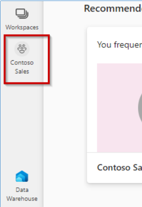

9. **Filter** for reports and **click** on the 'Real-Time and Historical in-store analytics with KQLDB' report.

	

	

10. **Hover** over the Average Temperature to see the real-time data in Power BI.

	

## Exercise 6: Power BI reports with Direct Lake

### Task 6.1: Leverage Power BI to derive actionable insights from data in Lakehouse using Direct Lake mode.

In this task, you will work with Power BI to reveal some valuable insights.

1. **Open** a new web session (tab) in the VM, and then enter: 'https://powerbi.com'.

>**Note:** Dismiss any popups that appear on your screen.

2. In Power BI service click on 'Workspaces' and **click** on 'contosoSales'. 

	

3. **Click** on 'Upload' and **select** 'Browse'.

	

4. **Browse** to the reports from your local system through the path "C:\LabFiles\IgniteDreamLab2023\artifacts\reports", **select** 'Campaign Analytics Report with Lakehouse.pbix' report and **click** on the 'Open' button.

	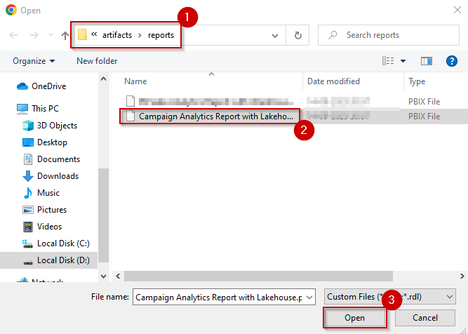

>**Note:** Wait for the report to be uploaded.

5. **Open** the report by clicking on it.

	

>**Note:** Make sure to click on the Report and not the Dataset or Dashboard which gets auto created with the same name.

   

6. This report has three sections:
 - Churn Analysis
 - Campaign Analytics
 - Website Analytics

	

7. Lets navigate to the **Churn Analysis Tab**, where we analyze Customer Churn. This report, along with Campaign Analytics and Website Analytics reports in Power BI, are coming from the data Lakehouse that we created in earlier exercises.

	

In the Scatter Chart on the left, the blue dots represent customers more likely to churn, and the peach dots represent customers less likely to churn. Notice that when customer tenure is low and their spend amount is low, the customers are more likely to churn.

   

With this insight, Wide World Importers decides to target customers with lesser tenure and lesser spend amounts through their new campaigns.

Now, let's go the Campaign Analytics.

8. Select the **Campaign Analytics** tab from the top right pane to navigate to the Campaign Analytics report.

	

In this Campaign Analytics report, the Bar chart shows that the most popular campaigns launched are gogreen and sustainablefashion.

   

Select **Website Analytics** from the top right pane to navigate to the Website Analytics Report.

   

Here we see an immediate problem for Wide World Importers. The bounce rate is high. It looks like a large population of their customers/visitors leave their website without much activity.

   

As a result of this analysis, Wide World Importers reduced their bounce rate by implementing a mobile-friendly website with fast product searches, focusing on high demand products for millenials. These changes not only improve the bounce rate dramatically, but they also reward Wide World Importers with uprecedented sales at their Cyber Monday Sale event.


#### Appendix

*To create reports based on the datasets created from the lakehouse*

1. In workspace, **click** on 'Filter' and **select** 'Lakehouse'.

    

2. **Click** on lakehouseSilver.

    

3. **Click** on 'New Power BI dataset'.

    

4. **Select** the required tables per the requirement
and **click** on the 'Confirm' button.

   

5. **Create** the data model per the requirement.

    

6. **Click** on 'New report' to create the Power BI report.

    

7. You would see the page shown in the screenshot.

    

8. **Select** Visuals and Columns to create the report.

    

9. **Build** a report per your requirements. Below you can see a sample report.

    


